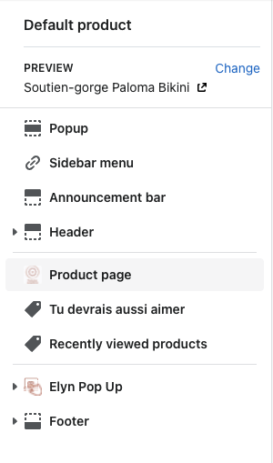

# Réassurance

Ce module permet d'insérer une image sous les CTAs d'achat, en page produit.

!!!secondary Une image au format horizontal est fortement recommandée.
!!!

### Mode d'emploi

##### 1. Ajouter une image de réassurance

  1. Aller les paramètres de thème: `Online Store` > `Themes` > sélectionner le thème > `Customize`
  2. Sélectionner `Default product` dans la liste de templates, sous `Products`

  

  3. Sélectionner la section `Product page`
    
  

  4. Les paramètres se trouvent dans la partie `Reassurance`

  