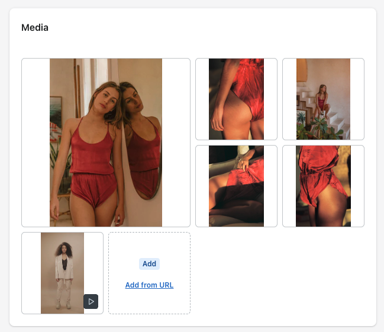
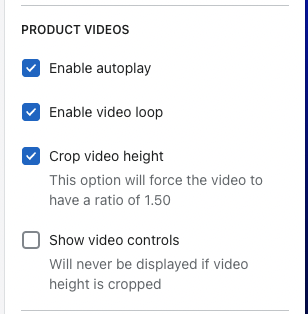

# Vidéos

Ce module permet d'insérer des vidéos dans la galerie d'images, en page produit.

### Mode d'emploi

##### 1. Ajouter la video sur la page produit

Dans le Back-Office de Shopify, ajouter une video dans la partie `Media`.

!!!secondary Une vidéo au format vertical est fortement recommandée
Le rendu sera le plus cohérent si la taille de la video a un ratio identique à celui des images du produit
!!!

  

!!!warning Formats vidéo 
Tous les formats de vidéo ne sont pas compatibles avec Shopify
!!!

Les videos doivent :

- être au format `.mp4` ou `.mov`
- ne pas dépasser **10 minutes**
- ne pas dépasser **1GB**
- avoir une résolution de max. 4K (**4096 x 2160 px**)

##### 2. Modifier les paramètres des vidéos 

  1. Aller les paramètres de thème: `Online Store` > `Themes` > sélectionner le thème > `Customize`
  2. Sélectionner `Default product` dans la liste de templates, sous `Products`

  

  3. Sélectionner la section `Product page`
    
  

  4. Les paramètres se trouvent dans la partie `Product videos`
    
  

  - `Enable autoplay` permet de démarrer automatiquement la vidéo quand elle est chargée
  - `Enable video loop` permet de faire tourner la vidéo en boucle
  - `Crop video height` permet de forcer la vidéo sous un ratio de 1.50, plutôt que de garder le format initial de la vidéo. Je conseillerais plutôt d'utiliser directement des vidéos qui ont un format identique ou similaire à celui des images du produit, pour garder une meilleure cohérence, surtout en mobile.
  - `Show video controls` permet d'afficher les boutons `Play`, `Pause` etc de la vidéo. Si l'option `Crop video height` est sélectionnée, ces boutons ne seront d'office pas visibles.

!!!light Remarque
Les paramètres sélectionnés pour les `Default product` seront aussi appliqués pour les autres templates de produits : `coming-soon` et `pre-order`.
!!!